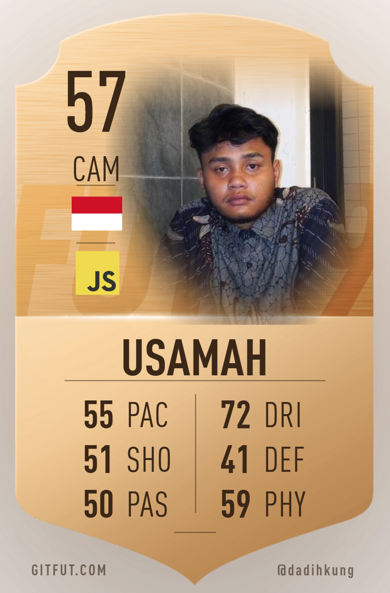

# ⚽ Usamah Ikhwana Fadhlih | Player Profile 🏆

  

  <b>POSITION:</b> <code>CAM / Full-Stack Web Developer</code> | <b>PREFERED FOOT:</b> <code>Go / PHP / JS</code>

  Building clean, performant, and scalable web applications. Passionate about backend architecture, API development, and modern user interfaces.

---

### 📋 Player Attributes & Scout Notes
* 🔭 **Current Club Role:** Building scalable backend architectures & web platforms.
* 🌱 **Skill Development:** Learning microservices architecture and high-performance execution.
* 💬 **Specialties:** **PHP/Laravel**, **Go**, **MariaDB/MySQL**, and **Database Migrations**.
* 📩 **Direct Line:** `dadihusamah@gmail.com`

---

### ⚽ Squad Lineup (Tech Stack)

**Playmakers & Attackers (Languages & Frameworks)**  

**Defenders & Pitch Management (Databases & Servers)**  

---

### 📊 Match Form & Season Performance

  

  

  

---

### 🌐 Transfer Market / Connect

