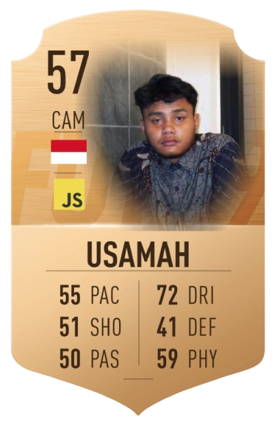

<b>PLAYER PROFILE CARD</b>

 

<table border="0" cellpadding="0" cellspacing="0" style="border-collapse: collapse; border: none; background-color: transparent; width: auto;">
  <tr style="border: none; background-color: transparent;">
    <td valign="top" width="280" style="border: none; background-color: transparent; padding: 0 20px 0 0;">
      
    </td>
    <td valign="top" style="border: none; background-color: transparent; padding: 0;">
      

        
      

      

        
        
        
        
      

      <b>CLUB:</b> <code>PT Cakrawala Mitra Bersama</code> 
      <b>POSITION:</b> <code>CAM / Full-Stack Web Developer</code> 
      <b>PREFERRED FOOT:</b> <code>Go / PHP / JS</code>  
      <b>📋 PLAYER ATTRIBUTES & SCOUT NOTES</b>
      <ul>
        <li><code><b>Current Club:</b> Full-Stack Developer at PT Cakrawala Mitra Bersama.</code></li>
        <li><code><b>Role:</b> Building scalable backend architectures & web platforms.</code></li>
        <li><code><b>Skill:</b> Learning microservices and high-performance execution.</code></li>
        <li><code><b>Specialties:</b> PHP/Laravel, Go, MariaDB/MySQL, SSH Security.</code></li>
        <li><code><b>Direct Line:</b> dadihusamah@gmail.com</code></li>
      </ul>
      <b>SQUAD LINEUP (Tech Stack)</b> 
      

        
        
        
        
        
        
        
      

    </td>
  </tr>
</table>

